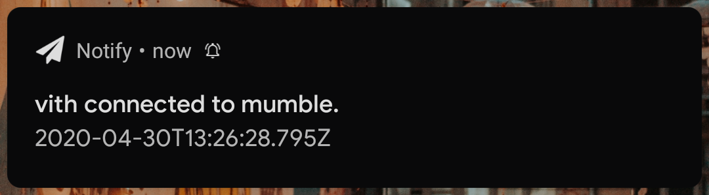

# mumble-friend-notifier

Monitors a mumble-server logfile, sending push notifications to your phone when your friends arrive.

Uses [tailfd] for resiliency through log file rotation.

Notifications are delivered via the [notify] android client.



# Configuration

Create a `.env` file based on `.env.example`.

# Installation as service

Set correct WorkingDirectory in `./distrib/mumble-friend-notifier.service`, then run:

```console
$ systemctl --user link $PWD/distrib/mumble-friend-notifier.service
$ systemctl --user enable --now mumble-friend-notifier.service
```

To enable the service to start at boot before you login, you may need to enable linger:

```console
$ sudo loginctl enable-linger "$USER"
```

[tailfd]: https://github.com/soldair/node-tailfd
[notify]: https://github.com/mashlol/notify
